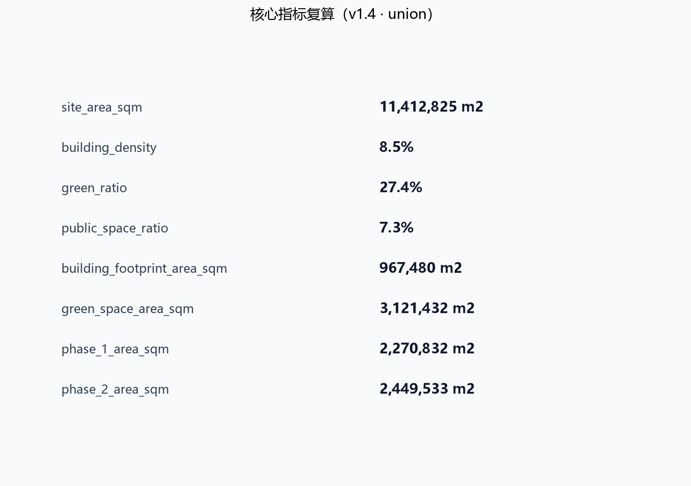

## 事实、概念与待确认三层声明

本方案所有内容按证据性质分为三层：**已确认事实（official）**、**概念建议（concept）**、**待官方确认（pending）**。正文中概念建议统一以 **（概念）** 标记，待官方确认事项以"待官方确认"表述。三层声明同时映射到 `compliance_matrix.json` 的 `evidence_type` 字段。

| 层级 | 内容 | 证据类型 | 使用边界 |
| --- | --- | --- | --- |
| 已确认事实 | 项目名称与主办方、总体设计范围约 11.4 km²、重点区域范围约 368.4 公顷、三处重点区公告面积（众智园 192.1 公顷、原点社区 104.3 公顷、大钟寺 72.0 公顷）、智能体任务书六项任务、城市设计管理等标准名称 | official | 可作为任务依据与空间讨论基准 [source:OFFICIAL-ANNOUNCEMENT] [source:AGENT-TASKBOOK] [standard:MOHURD-URBAN-DESIGN-MEASURES] |
| 概念建议 | 京张智脉命名与 Logo 方向、高度分级、场景卡、测试验证场景、朝圣地标、运营机制、拆改留与分期 | concept | 均为概念建议/参考方案，供专业团队深化，不构成政府审定或实施承诺 [source:AGENT-TASKBOOK] |
| 待官方确认 | 官方红线、重点区 polygon、控规容积率/高度/密度/退线、道路红线、市政管线、权属与工程条件 | pending | 正式数据发布后需重算图层与指标 [source:SITE-PACKAGE] [data:geometry/site_boundary.geojson#SITE-001] |

`compliance_matrix.json` 中每条任务标注主导证据类型；同一任务内部同时包含概念与待确认内容时，取主导类型并在正文中说明。

## 设计依据与资料清单

本方案以北京市规划和自然资源委员会海淀分局 2026 年 5 月发布的《百年京张AI创新带城市设计国际方案征集资格预审公告》为第一依据 [source:OFFICIAL-ANNOUNCEMENT]，以面向全球智能体的开源征集任务书摘录为智能体任务依据 [source:AGENT-TASKBOOK]，并完整读取 `brief/site-package/` 中的结构化任务书、枚举、允许设计空间、规划指标区间和 JSON Schema [source:SITE-PACKAGE]。资料权威性按照 `data/source_registry.json` 区分：公告正文和已清权任务书可用于正式任务响应，临时粗略边界只允许用于方案生成、自检与可视化 [source:SOURCE-REGISTRY]；`data/processed/agent_fact_pack.md` 作为导航层帮助把三层范围、六项智能体任务、资料用途与缺资料清单组织成可读方案 [source:PROCESSED-FACT-PACK]。

本方案使用仓库维护者提供的 `brief/site-package/geometry/provisional_boundaries.geojson` 作为总体设计范围边界与三处重点区域边界 [source:BOUNDARY-SOURCE] [source:KEY-AREA-SOURCE]。该边界是依据公告文字四至和约 11.4 平方公里面积形成的临时粗略 polygon，`official_boundary=false`、`geometry_role=provisional_constraint`，只能用于设计讨论、临时自检和离线展示，不得作为官方红线、审批依据或精确面积复算依据；组织方数据缺口不阻断内容评分，正式红线发布后需重新生成全部图层并复算指标 [data:geometry/site_boundary.geojson#SITE-001] [data:geometry/key_areas.geojson#PROV-KEY-001]。本方案遵循的行业标准包括：城市设计管理办法对公共空间与风貌统筹的要求 [standard:MOHURD-URBAN-DESIGN-MEASURES]、控制性详细规划编制审批办法对规划许可和实施管理边界的要求 [standard:MOHURD-CONTROL-DETAILED-PLANNING]、国土空间用地用海分类指南对用地代码的要求 [standard:MNR-LAND-USE-CLASSIFICATION-GUIDE]，以及建筑专业设计文件深度规定作为待补深度参照 [standard:MOHURD-ARCH-DESIGN-DEPTH-2016]。

本方案正文按正式方案深度组织 [depth:existing_conditions_diagnosis]，正文中每个核心判断都给出机器可读证据引用，供评审从文本回到 GeoJSON、metrics、矩阵和来源逐项核验。

### 资料分级与使用方法

方案资料按 `data/source_registry.json` 分为四级使用 [source:SOURCE-REGISTRY]：

| 级别 | 资料 | 使用方式 | 禁止用途 |
| --- | --- | --- | --- |
| A0 官方正式 | 资格预审公告、官方标准快照 | 任务依据、范围与面积、专业标准响应 | 不替代官方 GIS 红线与控规附件 |
| 清权用户资料 | 智能体任务书摘录 | agent 任务、场景、品牌、运营要求 | 不用于法定规划判断 |
| 仓库处理资料 | agent_fact_pack 与 CSV | 导航与任务索引 | 不替代原始来源 |
| provisional 资料 | provisional_boundaries.geojson | 临时生成、自检、可视化 | 不得作为红线、审批或精确面积依据 |

生成方法披露：本方案正文、几何、指标、图纸与 HTML 均由声明的 AI agent 依据上述资料生成，生成方式与责任边界见 `agent.json`、`report/copyright_statement.md` 与 `assumptions.json` [source:PROCESSED-FACT-PACK]。

## 三层范围工作框架

三层范围是公告确定的工作组织方式，本方案将其转译为"产业战略层、总体城市设计层、重点片区详细设计层"逐级落实的工作框架 [standard:PROJECT-OFFICIAL-ANNOUNCEMENT]。统筹研究范围约 43.6 平方公里，回答 AI 创新生态、三区两翼协同、未来城市形态和全球朝圣地叙事 [source:OFFICIAL-ANNOUNCEMENT]；总体设计范围约 11.4 平方公里，回答城市更新总体结构、用地功能、交通市政、蓝绿公共空间与风貌控制 [data:geometry/land_use.geojson#LU-001] [metric:site_area_sqm]；重点区域范围约 368.4 公顷，对众智园、北京 AI 原点社区、大钟寺三个片区开展达到规划综合实施方案深度的详细设计 [data:geometry/key_areas.geojson#PROV-KEY-001] [metric:key_area_total_sqm]。三层范围由 [depth:three_level_scope_framework] 和 [depth:overall_spatial_structure] 约束，具体面积均可在几何图层中复算。

由于官方红线尚未发布，本方案所有面积与比例均标注为"基于 provisional boundary 的临时复算"：例如提交边界面积 11,412,825 平方米、三处重点区合计 3,692,893 平方米，替换官方 polygon 后必须全部重算 [metric:key_area_count]。三层范围不是互不相干的图纸分层，而是从产业战略到地块更新的连续传导：统筹研究决定"两翼"产业分工，总体设计把分工落到用地、廊道和设施，重点区详细设计验证建筑、街道、公共空间与 AI 场景的可实施关系 [depth:overall_spatial_structure]。

### 三层范围传导机制

三层范围通过"目标-策略-图层"三级传导保证可复核 [depth:three_level_scope_framework]：

1. **目标传导**：统筹研究确定 AI 创新生态、人才与未来城市目标，转换为五大功能和三区两翼定位 [standard:PROJECT-AGENT-OPEN-CALL-TASKBOOK]。
2. **策略传导**：总体设计把定位转换为用地结构、交通市政、蓝绿与风貌策略，落到 `geometry/land_use.geojson` 等图层 [data:geometry/land_use.geojson#LU-001]。
3. **图层传导**：重点区详设把策略进一步落实到建筑、街道、公共空间和 AI 场景节点，形成可深化项目 [data:geometry/key_areas.geojson#PROV-KEY-002]。

三层传导结果与 `compliance_matrix.json` 逐条挂接，评审可从任务回查章节、图层、指标、图纸与 HTML [source:SITE-PACKAGE]。

## 现状诊断与问题清单

现状诊断是正式方案的设计起点。本方案基于公开资料、任务书文字描述与可复核的空间推断建立问题清单 [source:OFFICIAL-ANNOUNCEMENT]，不做未经授权的现状测绘结论，也不把推断写成精确现状；所有现状判断在正式红线与现状底图取得后需重新校核 [source:PROCESSED-FACT-PACK]。

### 现状特征研判

总体设计范围位于京张铁路遗址公园沿线两侧，历史上长期被铁路廊道分割，形成"西侧高校科研、东侧产业生活"的格局。现状特征可归纳为五点：

1. **铁路缝合缺口**：京张遗址公园虽已初步形成公共绿带，但跨主干路、跨环路节点与重点区衔接处仍存在慢行断点，公园对东西两侧的缝合作用尚未充分释放 [data:geometry/roads.geojson#ROAD-006]。
2. **产业空间分散**：高校、院所、孵化器和企业散布在学院路沿线，缺少连续的成果转化界面与公共服务配套，创新链在空间上呈现"多点但不成网"的状态 [data:geometry/land_use.geojson#LU-007]。
3. **蓝绿系统割裂**：清河、小月河与京张绿廊之间缺乏连续连接，滨河界面被道路与围墙阻断，公共空间品质不均衡 [data:geometry/green_space.geojson#GREEN-003]。
4. **设施承载不均**：轨道站点周边一体化程度不一，大钟寺站、五道口等站点周边步行环境与功能复合度差异明显，停车与非机动车停放缺乏系统组织 [data:geometry/public_space.geojson#PUBLIC-002]。
5. **风貌与文脉表达不足**：京张铁路文化、中关村创业文化与AI新文化的空间表达分散，缺少统一导视、标识和叙事系统 [depth:height_massing_character]。

### 问题清单与设计响应

| 编号 | 现状问题 | 设计响应 | 空间证据 | 深度项 |
| --- | --- | --- | --- | --- |
| D-01 | 铁路慢行断点 | 京张智脉绿廊南北贯通与跨路节点缝合 | [data:geometry/roads.geojson#ROAD-001] | [depth:traffic_rail_slow_parking] |
| D-02 | 创新网络不连续 | 原点社区成果转化街与发布轴带 | [data:geometry/buildings.geojson#BLDG-004] | [depth:three_key_area_detailed_design] |
| D-03 | 蓝绿系统割裂 | 绿廊、滨河绿地与站前广场复合连接 | [data:geometry/green_space.geojson#GREEN-002] | [depth:blue_green_public_space] |
| D-04 | 站点一体化不足 | 大钟寺站城一体与四象限步行连通 | [data:geometry/public_space.geojson#PUBLIC-002] | [depth:traffic_rail_slow_parking] |
| D-05 | 风貌文脉表达不足 | 统一导视、朝圣地标与文化叙事 | [standard:MOHURD-URBAN-DESIGN-MEASURES] | [depth:height_massing_character] |

现状诊断深度由 [depth:existing_conditions_diagnosis] 统一约束；诊断结论均以"概念研判 + 待官方底图复核"的方式表达，避免把推断写成现状事实 [source:SOURCE-REGISTRY]。

## 统筹研究范围产业与未来城市研究

统筹研究范围的核心判断是：把百年京张铁路的"自主创新起点"与海淀中关村的"创业创新生态"连接为一条可持续更新的 AI 创新脉。方案提出总体概念名 **（概念）**"京张智脉"（Jing-Zhang AI Pulse），英文名称 "AI Pulse Belt"，命名体系为 **（概念）**"一脉、两翼、三核、多场景节点"：一脉指京张智脉，两翼指中关村科技服务翼与小月河场景赋能翼，三核指三处重点片区，多场景节点指 AI+公共服务、产业服务、文化体验与治理实验组成的可运营网络 [source:AGENT-TASKBOOK] [standard:PROJECT-AGENT-OPEN-CALL-TASKBOOK]。

Logo 与视觉识别方向建议 **（概念）**：以两条并列钢轨抽象为两条脉冲线，构成形似字母 Z 的无限回环，象征京张铁路、中关村创新与 AI 数据流的交汇；主色建议采用钢青、电光蓝与暖橙三色，其中钢青对应铁路遗产、电光蓝对应 AI 算力、暖橙对应人文活力；辅助图形采用站点编号、轨枕刻度与脉冲波形，形成可用于导视、展板、数字界面的组件系统。该命名与视觉方向属于概念建议，不涉及任何已注册商标或未经授权字体 [depth:overall_spatial_structure]。

全球 AI 创新生态案例研究 **（概念）**（6 个，作为空间机制参考而非投资承诺）：

| 案例 | 可借鉴机制 | 转化到一带的空间动作 |
| --- | --- | --- |
| 硅谷大学策源与风险资本生态 | 大学成果转化、长周期资本、密度化交往 | 原点社区近校成果转化街与发布厅 [data:geometry/buildings.geojson#BLDG-004] |
| 剑桥科技带知识机构集聚 | 多所高校与科研机构形成知识街区 | 统筹研究范围高校策源网络与跨校慢行联系 |
| 特拉维夫技术转化生态 | 技术人才溢出与军民两用转化 | 众智园全栈测试与安全治理沙盒 [data:geometry/buildings.geojson#BLDG-003] |
| 新加坡智能国场景开放 | 公共数据开放、城市实验室、场景申请制 | 小月河场景赋能翼场景开放运营机制 |
| 伦敦知识园区文化运营 | 文化机构与科技企业共生的公共客厅 | 京张智脉绿廊文化展示与开放客厅 |
| 杭州城市级场景开放实践 | 以真实场景牵引产业测试与运营 | 大钟寺与全域 AI+场景测试验证节点 [data:geometry/constraints.geojson#CONSTRAINTS] |

五大功能在空间中落实为：AI 全栈自主创新体系对应众智园，世界级 AI 创新生态对应原点社区与中关村科技服务翼，AI+场景赋能新范式对应小月河场景赋能翼，智能化 AI 活力城市对应绿廊与社区网络，AI 治理全球话语权对应治理沙盒、标准工作坊与国际活动体系 [standard:PROJECT-AGENT-OPEN-CALL-TASKBOOK]。未来城市形态研究强调"可感知的 AI 城市"：不是把 AI 作为孤立技术，而是通过慢行、公共空间、站点与场景节点让居民和企业日常感知 AI 服务，并始终保留人工复核与公共利益优先原则 [depth:existing_conditions_diagnosis]。

### 区域协同与创新网络

一带不是孤立片区，而是海淀与更大创新网络连接的枢纽。本方案提出"四个圈层"协同框架 [source:OFFICIAL-ANNOUNCEMENT]：

1. **与北纬社区协同**：北纬社区及周边居住与科创社区为一带提供人才生活与日常服务腹地。建议通过京张智脉绿廊与社区慢行环连接，把社区公共客厅、教育设施与 AI 场景节点组织进同一服务网络，避免重点区与社区生活割裂 [data:geometry/roads.geojson#ROAD-008]。
2. **与未来科学城协同**：未来科学城承担大科学装置、能源材料和先进制造等硬科技研发。一带可承接其成果转化的城市服务端，形成"未来科学城源头研发、海淀一带场景转化与总部服务"的分工 [depth:overall_spatial_structure]。
3. **与怀柔科学城协同**：怀柔科学城以基础研究和国家实验室为特色。一带通过高校院所网络、数据要素会客厅和国际路演客厅，为基础研究成果提供算法、数据、算力与资本的中试和发布界面 [data:geometry/buildings.geojson#BLDG-008]。
4. **与京津冀协同**：依托京张铁路历史通道和京冀高速铁路网，一带可形成"京津雄研发、海淀创新带总部与场景、京张沿线制造与算力节点"的梯度协同，把百年京张通道转化为面向全球的 AI 产业协作走廊 [source:AGENT-TASKBOOK]。

区域协同结论均为概念建议，不涉及跨区域行政边界调整或已确定产业布局；正式深化时应与相关区县规划、科技园区规划和区域协同政策校核 [source:PROCESSED-FACT-PACK]。

## 总体设计范围城市更新与控规深度城市设计

总体设计范围的城市更新框架为"绿廊缝合、两翼焕新、三核点亮"。绿廊缝合指以京张遗址公园活力带为南北主轴，缝合被铁路分割的东西城市片区 [data:geometry/green_space.geojson#GREEN-002]；两翼焕新指中关村科技服务翼强化要素服务、小月河场景赋能翼强化场景测试与公共服务；三核点亮指三处重点片区形成可运营的 AI 创新锚点 [data:geometry/key_areas.geojson#PROV-KEY-002]。

用地结构以"中部生态文化、西部科技服务、东部产业生活"为主：提交边界内共划分 25 个用地单元 [data:geometry/land_use.geojson#LU-001]，其中科研用地覆盖 AI 研发与成果转化 [data:geometry/land_use.geojson#LU-013]、商业服务业用地覆盖产业服务与智能消费 [data:geometry/land_use.geojson#LU-010]、公园绿地构成京张智脉绿廊 [data:geometry/land_use.geojson#LU-006]，其余为教育、文化、居住、社区服务、公共广场、留白与道路用地。v1.4 加密后建筑基底总面积为 967,480 平方米 [metric:building_footprint_area_sqm]，建筑密度 8.5%，作为概念空间供给基数，不代表审批容积率 [depth:land_use_layout]。

开发强度、建筑高度、建筑密度、绿地率与退线等指标属于官方控规条件，当前 `brief/site-package/ranges/planning_limits.json` 中全部为缺失状态 [source:SITE-PACKAGE]。因此本方案不设定审定容积率或建筑高度，而是在 [depth:development_intensity_controls] 中明确"待正式控规确认"的清单，并以设计建议层级表达建筑体量与界面关系 [depth:height_massing_character]。更新对象采用"保留、改造、新建、留白"四类表达 [depth:retain_renovate_demolish]：教育科研与历史文脉相关建筑建议保留为主，低效产业空间建议改造更新，重点片区关键功能节点建议新建，众智园北侧与城市边缘建议留白弹性空间 [data:geometry/buildings.geojson#BLDG-001]。

### 建筑形态控制引导

建筑形态控制以城市设计管理办法确定的"统筹建筑布局、塑造特色风貌"为原则 [standard:MOHURD-URBAN-DESIGN-MEASURES]，在控规条件取得前只提出分级引导框架，不设定审定高度与容积率 [depth:development_intensity_controls]。

#### 高度控制引导

建议采用"绿廊低、两翼中、三核门户高"的分级结构 [depth:height_massing_character]：

| 高度带 | 建议对象 | 控制引导 | 对应图层 |
| --- | --- | --- | --- |
| 低层带（概念 12-24m） | 京张智脉绿廊两侧、文保与滨河界面 | 保持视线通透、体量轻盈、屋顶绿化和文化公共界面 | [data:geometry/green_space.geojson#GREEN-002] |
| 中层带（概念 24-60m） | 原点社区、社区服务环、一般产业街区 | 以街道尺度控制界面连续性与日照通风 | [data:geometry/buildings.geojson#BLDG-004] |
| 高层带（概念 60-100m 待确认） | 众智园、大钟寺站城一体化门户节点 | 作为片区标识性节点，控制对绿廊的遮挡 | [data:geometry/buildings.geojson#BLDG-007] |

#### 界面设计引导

- **街道界面**：临绿廊、滨河和主要商业街的首层建议以连续公共界面为主，鼓励退线空间与骑楼、檐廊、开放门厅结合，形成可停留的街道客厅 [standard:MOHURD-URBAN-DESIGN-MEASURES]。
- **退线与贴线**：重要街道按照街区尺度建议控制退线区间与贴线率，避免零散退让造成街道界面破碎；具体退线以官方道路红线与控规为准 [depth:development_intensity_controls]。
- **首层功能**：重点区首层优先布置展示、发布、零售、咖啡、共享办公与社区服务等可达功能，AI 场景节点与公共空间界面衔接 [data:geometry/buildings.geojson#BLDG-005]。

#### 屋顶形态引导

- **第五立面**：鼓励平屋顶绿化、光伏板和公共活动平台复合利用，绿廊两侧与滨河界面控制屋顶设备外露 [depth:height_massing_character]。
- **天际线**：三核门户节点形成可识别的天际线起伏，但不得遮挡京张遗址公园方向的重要视廊；具体高度控制以航空、文保与景观视廊评估为准 [source:SITE-PACKAGE]。
- **文化符号**：屋顶与檐口可结合京张铁路钢轨、信号灯与中关村数字网格等符号做适度表达，但不得侵权、不得娱乐化 [source:AGENT-TASKBOOK]。

建筑形态引导全部为设计建议层级，供专业团队在取得控规条件后深化为审定控制线 [depth:retain_renovate_demolish]。

### 城市更新对象识别

更新对象识别采用"保留、改造、新建、留白"四类方法 [depth:retain_renovate_demolish]：

1. **保留对象**：文保单位、历史建筑、教育科研主体建筑与结构完好的公共设施，以保护与功能提升为主 [standard:MOHURD-URBAN-DESIGN-MEASURES]。
2. **改造对象**：低效产业用房、老旧社区服务设施与闲置空间，通过功能置换、立面更新与公共空间复合实现存量激活 [data:geometry/buildings.geojson#BLDG-009]。
3. **新建对象**：三核门户节点、站城一体化界面与关键公共空间，新建必须满足控规、文保与工程条件 [data:geometry/buildings.geojson#BLDG-007]。
4. **留白对象**：众智园北侧与城市边缘预留弹性空间，为未来算力、试验与运营模式留出余地 [data:geometry/land_use.geojson#LU-019]。

评估维度包括结构安全、功能价值、文保要求、权属条件、公共贡献与实施成本；具体评估需在现状普查与官方资料取得后进行 [source:PROCESSED-FACT-PACK]。

## 重点区域详细设计

### 众智园AI自主创新加速区

**唯一锚点**：全栈测试验证 + 安全治理沙盒——众智园不与原点社区、大钟寺争夺"生态叙事"，而是承担模型评测、端侧算力验证、标准工作坊与城市智能体治理推演的硬测试场 [data:geometry/buildings.geojson#BLDG-013] [data:geometry/public_space.geojson#PUBLIC-006]。空间结构采用"一廊两带一谷"：清河低碳创新廊串联滨河绿色空间与低碳算力展示 [data:geometry/green_space.geojson#GREEN-003] [data:geometry/green_space.geojson#GREEN-004]，两带指创新研发带与测试验证带，一谷指众智园中央创新谷。建筑更新以 AI 研发中心 [data:geometry/buildings.geojson#BLDG-001]、开源孵化器 [data:geometry/buildings.geojson#BLDG-002]、全栈测试实验室 [data:geometry/buildings.geojson#BLDG-003] 与安全治理中心 [data:geometry/buildings.geojson#BLDG-013] 为概念抓手；公共空间以众智园开源发布广场 [data:geometry/public_space.geojson#PUBLIC-006] 与测试展示广场 [data:geometry/public_space.geojson#PUBLIC-005] 承载开放评测、标准工作坊与安全治理展示 [depth:three_key_area_detailed_design]。实施风险：河道蓝线、生态与防洪条件、控规条件均待官方确认 [source:PROCESSED-FACT-PACK]。

### 北京AI原点社区

**唯一锚点**：成果转化街 + 发布轴 + 近校慢网——原点社区以"从实验室到街区"的连续界面为核心，不做总部门户，而做高校师生与开源开发者的日常转化通道 [data:geometry/buildings.geojson#BLDG-004] [data:geometry/roads.geojson#ROAD-011] [data:geometry/public_space.geojson#PUBLIC-008]。空间结构采用"街区缝合、发布轴带、社区服务环"：通过成果转化街 [data:geometry/buildings.geojson#BLDG-004] 缝合校区、园区与街区，以成果发布厅 [data:geometry/buildings.geojson#BLDG-005] 和原点社区创客客厅 [data:geometry/public_space.geojson#PUBLIC-008] 形成面向开源社区与高校师生的发布轴带，以人才公寓 [data:geometry/buildings.geojson#BLDG-006] 和开源成果展示廊 [data:geometry/buildings.geojson#BLDG-021] 形成完整生活环。重点区详细设计与轨道站点一体化、慢行缝合和首层业态共同组织 [depth:three_key_area_detailed_design]。实施风险：校区边界、权属与首层业态调整需专业深化 [source:AGENT-TASKBOOK]。

### 大钟寺AI产业聚集区

**唯一锚点**：站城一体 + 四象限慢行 + 产业门户——大钟寺以轨道站点为城市门厅，以四象限步行连通组织产业服务与国际交往，不做研发测试，而做要素流通与品牌展示 [data:geometry/public_space.geojson#PUBLIC-010] [data:geometry/roads.geojson#ROAD-019] [data:geometry/buildings.geojson#BLDG-024]。空间结构采用"站城一体、四象限连通、文化商业复合"：以站城一体 TOD 裙房 [data:geometry/buildings.geojson#BLDG-024] 和 AI 文化展示馆 [data:geometry/buildings.geojson#BLDG-008] 形成站前复合界面，以大钟寺四象限步行广场 [data:geometry/public_space.geojson#PUBLIC-010] 实现四象限步行连通 [data:geometry/roads.geojson#ROAD-003]，以数据要素会客厅 [data:geometry/buildings.geojson#BLDG-023] 与国际路演客厅 [data:geometry/buildings.geojson#BLDG-025] 承载产业服务 [depth:three_key_area_detailed_design]。实施风险：轨道站点、道路交叉口与市政管线条件待官方附件确认 [source:OFFICIAL-ANNOUNCEMENT]。

三处重点区共同构成 [metric:key_area_count] 个详细设计单元，全部在提交边界内且互不重叠，详细设计深度由 [depth:three_key_area_detailed_design] 统一校核。

### 三核差异化协同：测试—转化—流通

三处重点区不是三个平行园区，而是 AI 创新链"测试→转化→流通"三段式分工的差异化空间载体。每个核只承担一个不可替代的角色，唯一锚点互不重叠，共同构成从技术可信度到市场流通的完整闭环；三核的差异化定位已同步写入 `geometry/key_areas.geojson` 各要素的 `design_role` 属性，正文叙事与图层证据一一对应 [data:geometry/key_areas.geojson#PROV-KEY-001] [data:geometry/key_areas.geojson#PROV-KEY-002] [data:geometry/key_areas.geojson#PROV-KEY-003]。

| 片区 | 差异化角色 | 唯一锚点 | 空间结构 | 主导场景卡 | 主导分期 |
| --- | --- | --- | --- | --- | --- |
| 众智园 | 硬测试场 | 模型评测、端侧算力验证、标准工作坊与治理推演 [data:geometry/buildings.geojson#BLDG-013] | 一廊两带一谷 [data:geometry/green_space.geojson#GREEN-004] | SC-02/06/11/12 | 一期 |
| AI原点社区 | 转化通道 | 高校师生与开源开发者的日常转化通道，不做总部门户 [data:geometry/buildings.geojson#BLDG-004] | 街区缝合、发布轴带、社区服务环 [data:geometry/public_space.geojson#PUBLIC-008] | SC-01/04/07/09 | 二期 |
| 大钟寺 | 流通门户 | 要素流通与品牌展示，不做研发测试 [data:geometry/public_space.geojson#PUBLIC-010] | 站城一体、四象限连通、文化商业复合 [data:geometry/buildings.geojson#BLDG-024] | SC-05/08/10 | 一期 |

三段协同逻辑 **（概念）** 为：**测试端**（众智园）产出可信评测、标准与治理规则，为全带的 AI 产品建立准入门槛；**转化端**（原点社区）把通过测试的成果变成街区可感知的产品、发布与日常服务，形成"从实验室到街区"的连续界面；**流通端**（大钟寺）依托站城门户把成熟产品与品牌推向要素市场与国际舞台。两翼在旁支撑：中关村科技服务翼为转化端提供要素服务 [data:geometry/roads.geojson#ROAD-014]，小月河场景赋能翼为测试端提供真实场景试验田 [data:geometry/roads.geojson#ROAD-016]。三核差异化加协同，使"一脉三核"成为一条可运营的 AI 产业链闭环，而非三个孤立园区 [depth:three_key_area_detailed_design]。

### 重点区域详细设计补充

#### 众智园补充设计

- **功能业态**：建议围绕自主模型研发、算力调度、安全评测、标准治理和产业展示组织功能，预留共享测试场、模型评测实验室与开源协作社区 [data:geometry/buildings.geojson#BLDG-002]。
- **建筑规模**：建筑基底面积约为概念研发楼宇总和，具体总规模、层数和容量以控规与工程条件为准 [metric:building_footprint_area_sqm]。
- **交通组织**：建议在南北主轴与东西联络线交汇处设置共享交通节点，组织园区接驳、货运分流与非机动车停放 [data:geometry/roads.geojson#ROAD-005]。
- **公共空间**：清河低碳创新廊与测试展示广场共同构成园区公共客厅，承载开放测试、成果发布和标准工作坊 [data:geometry/public_space.geojson#PUBLIC-005]。
- **实施风险**：河道蓝线、生态与防洪条件、控规指标和产权边界均待官方确认 [depth:risk_missing_data]。

#### 原点社区补充设计

- **功能业态**：以近校成果转化、开源发布、人才服务、居住配套为核心，组织成果转化街、发布厅、人才公寓和社区服务环 [data:geometry/buildings.geojson#BLDG-006]。
- **建筑形态**：建议以中低层为主，沿成果转化街形成连续展示界面，沿校区边界保持体量谦让与视线通透 [depth:height_massing_character]。
- **交通组织**：建议组织校区-园区-街区慢行缝合，弱化围墙分隔，设置无障碍通道与共享单车接驳点 [data:geometry/roads.geojson#ROAD-004]。
- **公共空间**：原点社区发布广场与绿廊活动场衔接，形成从校园到街区的完整发布轴线 [data:geometry/public_space.geojson#PUBLIC-004]。
- **实施风险**：校区边界、权属、首层业态调整和轨道站点接驳条件待专业深化 [source:AGENT-TASKBOOK]。

#### 大钟寺补充设计

- **功能业态**：以智能终端、内容消费、数据要素、国际路演和总部服务为主，组织智能消费综合体、AI 文化展示馆与数据要素会客厅 [data:geometry/buildings.geojson#BLDG-007]。
- **建筑形态**：站城一体节点建议形成门户型体量，与轨道站点、道路交叉口和城市广场形成复合界面 [depth:height_massing_character]。
- **交通组织**：围绕大钟寺站组织四象限步行连通，强化地下过街、无障碍路径与公交接驳 [data:geometry/public_space.geojson#PUBLIC-002]。
- **公共空间**：站前广场承担集散、展示、路演与节庆活动，并与绿廊南端活动场连接 [data:geometry/green_space.geojson#GREEN-001]。
- **实施风险**：轨道站点改造、道路红线、市政管线与产权整合条件待官方附件确认 [source:OFFICIAL-ANNOUNCEMENT]。

三处重点区补充设计均达到"定位 + 功能 + 建筑 + 交通 + 公共空间 + 风险"的规划综合实施方案概念深度 [depth:three_key_area_detailed_design]。

## AI 创新生态、人才画像与 AI+ 场景

AI 创新生态按"策源、转化、加速、场景、治理"五段组织，与三区两翼一一对应 [standard:PROJECT-AGENT-OPEN-CALL-TASKBOOK]。本方案形成 6 类用户画像：

| 用户画像 | 典型需求 | 空间响应 |
| --- | --- | --- |
| 开源开发者 | 发布、协作、测试、社区声誉 | 原点社区发布厅、开源成果展示廊、夜间协作空间 |
| 初创团队 | 低成本办公、算力入口、产品试验场 | 众智园共享测试场、端侧算力驿站、标准治理咨询 |
| 头部企业访客 | 展示、商务、国际接待、人才招聘 | 大钟寺国际路演客厅、轨道接驳、重点企业公共界面 |
| 周边居民 | 通勤、休闲、社区服务、低扰动更新 | 京张智脉绿廊、社区服务环、活动分级与夜间照明 |
| 高校师生 | 成果转化、跨校协作、日常慢行 | 近校成果转化街、跨校慢行网络、AI 教育体验点 |
| 城市治理者 | 公开数据、人工复核、风险预警 | 城市智能体治理沙盘、安全治理沙盒、标准工作坊 |

AI 场景卡 **（概念）** 共 12 张，其中至少 3 张为产业测试验证场景：

| 编号 | 场景卡 | 空间载体 | 场景类型 |
| --- | --- | --- | --- |
| SC-01 | 开源发布厅 | 原点社区成果发布厅 | 社区运营场景 |
| SC-02 | 安全治理沙盒 | 众智园测试展示广场 | 产业测试验证场景 |
| SC-03 | 端侧算力驿站 | 全域公共服务节点 | 新基建场景 |
| SC-04 | AI 慢行导航 | 京张智脉绿廊 | 公共服务场景 |
| SC-05 | 大钟寺国际路演客厅 | 大钟寺站前复合界面 | 产业服务场景 |
| SC-06 | 清河低碳创新廊 | 众智园滨河绿廊 | 绿色场景 |
| SC-07 | 近校成果转化街 | 原点社区成果转化街 | 产业孵化场景 |
| SC-08 | 数据要素会客厅 | 大钟寺片区 | 数据治理场景 |
| SC-09 | AI 生活服务样板街 | 社区服务环 | 公共服务场景 |
| SC-10 | 全球 AI 活动周路线 | 京张智脉绿廊与重点区 | 运营活动场景 |
| SC-11 | 全栈模型评测场 | 众智园全栈测试实验室 | 产业测试验证场景 |
| SC-12 | 城市智能体治理沙盘 | 众智园治理展示节点 | 产业测试验证场景 |

每个场景卡在正文中说明服务对象、空间位置、运行数据、隐私边界、人工复核、运营主体和风险 [depth:metrics_recalculation]；场景-空间-运营映射见 compliance_matrix.json 与 visual/index.html。所有场景均为概念建议，不构成已批准运营安排；隐私与数据使用遵循数据最小化、公开来源、可解释和人工复核原则 [source:AGENT-TASKBOOK]。

### 场景-空间-运营映射

| 场景卡 | 空间载体 | 服务对象 | 运行数据 | 隐私边界 | 人工复核 | 运营主体（概念） | 风险 |
| --- | --- | --- | --- | --- | --- | --- | --- |
| SC-01 开源发布厅 | 原点社区成果发布厅 | 开发者、高校师生 | 预约、发布、签到聚合统计 | 不采集个人行为轨迹 | 活动审核 | 社区运营联合体 | 内容合规 |
| SC-02 安全治理沙盒 | 众智园测试展示广场 | 模型企业、治理机构 | 测试报告、标准工作坊 | 测试数据脱敏 | 专家评审 | 园区运营机构 | 数据安全 |
| SC-03 端侧算力驿站 | 全域公共服务节点 | 居民、初创团队 | 使用时长、服务调用量 | 匿名聚合 | 服务审计 | 公共服务平台 | 算力滥用 |
| SC-04 AI 慢行导航 | 京张智脉绿廊 | 行人、骑行人群 | 慢行流量、断点识别 | 不识别个人 | 人工复核 | 公共空间管理方 | 过度监控 |
| SC-05 国际路演客厅 | 大钟寺站前复合界面 | 企业访客、国际团队 | 场次、参会规模 | 报名信息授权 | 会务审核 | 会展运营机构 | 活动安全 |
| SC-06 低碳创新廊 | 众智园滨河绿廊 | 园区员工、居民 | 能源与绿廊使用统计 | 聚合数据 | 设备巡检 | 能源服务商 | 工程可行性 |
| SC-07 近校转化街 | 原点社区成果转化街 | 高校团队、初创 | 孵化、融资对接统计 | 成果数据授权 | 转化评审 | 转化服务中心 | 知识产权 |
| SC-08 数据要素会客厅 | 大钟寺片区 | 数据商、律所、企业 | 流通合规案例 | 授权可审计 | 合规审核 | 数据治理平台 | 隐私合规 |
| SC-09 生活服务样板街 | 社区服务环 | 居民 | 服务预约、评价 | 最小化采集 | 服务监督 | 社区运营方 | 服务伦理 |
| SC-10 全球 AI 活动周 | 京张智脉绿廊与重点区 | 全球开发者、公众 | 活动参与统计 | 报名授权 | 活动审批 | 活动组委会 | 传播风险 |
| SC-11 全栈模型评测场 | 众智园测试实验室 | 模型团队、评测机构 | 评测基准、结果 | 模型数据脱敏 | 评测委员会 | 评测机构 | 评测公允 |
| SC-12 治理沙盘 | 众智园治理展示节点 | 治理者、公众 | 治理推演、反馈 | 公开资料 | 人类决策 | 治理联合体 | 决策责任 |

所有场景均为概念建议，运营主体与数据机制待专业团队和主管部门深化确认 [depth:metrics_recalculation]。

## 用地、建筑规模与拆改留方案

用地分类统一采用国土空间用地用海分类代码 [standard:MNR-LAND-USE-CLASSIFICATION-GUIDE]。提交边界内用地单元 25 个，绿地与开敞空间面积 3,121,432 平方米、占比 27.4% [metric:green_ratio] [metric:green_space_area_sqm]，公共空间面积 830,792 平方米、占比 7.3% [metric:public_space_ratio] [metric:public_space_area_sqm]，建筑基底 967,480 平方米、建筑密度 8.5% [metric:building_density]。

拆改留方案 **（概念）** 以"保留优先、改造为主、新建精准、留白弹性"为原则：文保与教育科研建筑建议保留，低效产业与社区设施建议改造，三核关键节点建议新建，众智园北侧与城市边缘建议留白。所有拆改留表达均为概念建议 [depth:retain_renovate_demolish]，不涉及地块权属与法定审批；控规容积率、建筑高度、建筑密度、绿地率与退线列为待确认事项 [depth:development_intensity_controls]。建筑形态与风貌控制以体量分级、界面连续性和屋顶形态为设计建议 [depth:height_massing_character]，由 A3/A0 图纸与 HTML 可视化表达 [source:SITE-PACKAGE]。

### 用地结构细化

#### 功能比例建议（概念）

| 用地大类 | 用地代码 | 功能指向 | 概念比例 | 复算依据 |
| --- | --- | --- | --- | --- |
| 科研用地 | 0802 | AI 研发、成果转化 | 约 26% | [data:geometry/land_use.geojson#LU-013] |
| 公园绿地 | 1401 | 京张智脉绿廊 | 约 27% | [metric:green_ratio] |
| 商业服务业 | 05 | 产业服务、智能消费 | 约 15% | [data:geometry/land_use.geojson#LU-010] |
| 教育文化 | 0804/0803 | 高校、文化展示 | 约 12% | [data:geometry/land_use.geojson#LU-008] |
| 居住社区 | 0701/0702 | 人才社区、生活配套 | 约 13% | [data:geometry/land_use.geojson#LU-009] |
| 公共服务 | 0806/1403 | 医疗、体育、广场 | 约 7% | [data:geometry/public_space.geojson#PUBLIC-001] |
| 留白与弹性 | 16 | 未来弹性空间 | 约 2% | [data:geometry/land_use.geojson#LU-019] |

功能比例为基于提交边界的临时复算概念值，正式控规和官方边界确定后必须重算 [metric:land_use_count]。

#### 建筑规模与空间供给

- 建筑基底总面积 967,480 平方米、建筑密度 8.5%，作为概念空间供给基数 [metric:building_footprint_area_sqm]。
- 建议产业空间、人才居住与公共服务按"五三二"概念结构配置，即产业与创新空间约占 50%、居住社区约占 30%、公共服务与配套约占 20%，具体比例以控规与市场评估为准 [depth:land_use_layout]。
- 新建与改造项目优先利用低效工业与仓储空间，严格控制新增建设用地，突出存量更新导向 [depth:retain_renovate_demolish]。

## 交通、轨道、市政与公共服务设施

交通方案以"轨道站城一体、绿廊慢行贯通、两翼微循环缝合"为框架 [data:geometry/roads.geojson#ROAD-006]。提交边界内概念道路总长约 95,524 米 [metric:road_length_m]，其中绿道与自行车道慢行系统长约 39,206 米 [metric:greenway_length_m]；南北主轴两线 [data:geometry/roads.geojson#ROAD-001] [data:geometry/roads.geojson#ROAD-002] 与东西联络线 [data:geometry/roads.geojson#ROAD-003] [data:geometry/roads.geojson#ROAD-004] [data:geometry/roads.geojson#ROAD-005] 及 v1.4 加密微循环 [data:geometry/roads.geojson#ROAD-013] [data:geometry/roads.geojson#ROAD-014] 共同缝合三核与两翼 [depth:traffic_rail_slow_parking]。轨道站点一体化以五道口、清华东路西口、大钟寺站等为概念研究对象，道路红线、轨道线位、桥梁隧道与市政管线均列为待官方确认条件 [source:OFFICIAL-ANNOUNCEMENT]。

市政与新型基础设施建议采用"传统市政 + 端侧算力 + 分布式能源"复合模式：在社区服务环与产业节点布置端侧算力驿站，在滨河与绿廊空间试点低碳能源展示，在重点区地下空间与管廊条件明确前不作出工程结论 [depth:municipal_new_infrastructure]。公共服务设施按 15 分钟生活圈组织社区服务、医疗健康、文化教育与体育设施，AI 健康服务综合体 [data:geometry/buildings.geojson#BLDG-010] 与社区服务综合体作为概念样例 [depth:traffic_rail_slow_parking]。

### 交通、轨道与市政细节

#### 道路与慢行

- **道路等级**：建议形成"快速路-主干路-次干路-支路-慢行绿道"五级网络；提交边界内概念道路总长 95,524 米 [metric:road_length_m]，其中慢行绿道 39,206 米 [metric:greenway_length_m]。
- **慢行断点缝合**：优先处理京张绿廊与北五环、学院路、西土城路等交叉节点，采用过街天桥、地面信号或地下通道等多种方案比较，不预设工程结论 [data:geometry/roads.geojson#ROAD-006]。
- **停车与接驳**：建议轨道站点周边采用"步行优先 + 公交接驳 + 共享单车 + 集约停车"模式，重点企业周边设置分时共享停车 [data:geometry/public_space.geojson#PUBLIC-002]。

#### 轨道站点一体化

- **五道口站**：建议围绕站点组织高校与企业交汇界面，优化出入口与慢行空间 [depth:traffic_rail_slow_parking]。
- **清华东路西口站**：建议与原点社区成果转化街联动，组织轨道接驳与人才服务设施 [data:geometry/buildings.geojson#BLDG-004]。
- **大钟寺站**：建议形成站城一体核心，四象限步行连通与公共活动复合 [data:geometry/public_space.geojson#PUBLIC-002]。

#### 市政与新型基础设施

- **端侧算力驿站**：建议结合公共服务设施布置端侧算力、边缘计算与 AI 服务终端，作为新型基础设施原型 [depth:municipal_new_infrastructure]。
- **分布式能源**：建议在滨河与绿廊节点试点光伏、地源热泵等低碳能源展示，具体负荷与容量需专业测算 [source:SITE-PACKAGE]。
- **智慧市政**：建议结合城市智能体治理沙盘组织管网监测、照明节能、公共安全预警等场景，遵循数据最小化与人工复核 [source:AGENT-TASKBOOK]。

交通与市政结论均不构成工程可行性判断，道路红线、轨道线位、市政管线与能源容量待官方条件确认 [depth:risk_missing_data]。

## 蓝绿空间、公共空间与城市风貌

蓝绿公共空间以京张智脉绿廊为主轴 [data:geometry/green_space.geojson#GREEN-002]，向北延伸众智园滨河绿廊 [data:geometry/green_space.geojson#GREEN-003]，向南连接大钟寺站前广场与城市公园 [data:geometry/green_space.geojson#GREEN-001]，形成南北贯通、东西缝合的复合开放空间系统 [standard:MOHURD-URBAN-DESIGN-MEASURES]。公共空间节点包括原点社区发布广场 [data:geometry/public_space.geojson#PUBLIC-004]、众智园测试展示广场 [data:geometry/public_space.geojson#PUBLIC-005] 与大钟寺站前广场 [data:geometry/public_space.geojson#PUBLIC-002]，承载发布、测试、活动与日常交往 [depth:blue_green_public_space]。

AI 朝圣地标（概念）不少于 3 个：清华园原点碑（以清华园车站旧址文化为依托的智能体贡献荣誉墙与原点标识）、京张智脉步道（开发者散步道与开源成果展示廊）、开源成果发布塔（原点社区成果发布厅地标）、大钟寺 AI 时代钟（国际路演客厅公共艺术地标）[source:AGENT-TASKBOOK]。所有地标均为概念建议，不涉及已批准建设、不侵犯文保与绿地约束 [depth:blue_green_public_space]。城市风貌建议"钢青底色、科技界面、人文节点"：建筑体量沿绿廊逐级降低，重点片区形成辨识性门户，公共艺术与导视系统统一使用京张智脉视觉语言 [depth:height_massing_character]。

### 蓝绿系统与活动组织

#### 蓝绿网络结构

蓝绿系统按"一脉两水多园"组织：一脉为京张智脉绿廊，两水为清河与小月河蓝绿界面，多园为沿绿廊与两翼布局的社区公园和广场节点 [data:geometry/green_space.geojson#GREEN-002]。

#### 活动组织引导

- **日常活动**：慢行通勤、晨跑、社区市集与户外办公，沿绿廊组织分级活动场地 [data:geometry/public_space.geojson#PUBLIC-003]。
- **主题活动**：开源发布、AI 开放日、标准工作坊与国际路演，依托三核广场组织 [data:geometry/public_space.geojson#PUBLIC-004]。
- **节庆活动**：全球 AI 活动周路线串联三核与绿廊，形成可传播的城市事件 [data:geometry/phasing.geojson#PHASE-002]。

#### 风貌与屋顶引导

风貌引导遵循"钢青底色、科技界面、人文节点"，沿绿廊控制建筑色彩与材料反射，鼓励屋顶绿化与光伏复合 [standard:MOHURD-URBAN-DESIGN-MEASURES]；朝圣地标与导视系统统一采用京张智脉视觉语言 [source:AGENT-TASKBOOK]。

## 更新项目清单、实施政策与分期计划

v1.4 重构分期逻辑：`geometry/phasing.geojson` 中三期 polygon 已全部裁剪至提交边界，三期互不重叠且面积之和等于提交边界面积（11,412,825 平方米，数值噪声 <0.001%），不再出现"分期面积越界或超过边界"的几何缺陷 [data:geometry/phasing.geojson#PHASE-001] [metric:phasing_total_sqm]。近期启动区面积 2,270,832 平方米 [metric:phase_1_area_sqm]，中期 2,449,533 平方米 [metric:phase_2_area_sqm]，远期 6,692,494 平方米 [metric:phase_3_area_sqm]，均可在 phasing 图层复算 [depth:phasing_implementation]。

分期叙事的主线是**三核差异化能力的兑现顺序**：不是把三个片区简单切分到三个时间段，而是让每一期承担一个差异化主题，用上一期验证过的机制支撑下一期扩张——"先测试、再转化、后开放"：

1. **一期（2026–2028）"双门户试点"**：众智园硬测试场与大钟寺站城门户同步启动。众智园验证"测试—治理"闭环（全栈评测、安全沙盒、标准工作坊），大钟寺验证"门户—流通"闭环（站城一体、四象限步行、国际路演）。两个核互为镜像：一个向内打磨技术可信度，一个向外验证要素流通效率。
2. **二期（2028–2030）"转化轴成型"**：把一期验证的机制引向原点社区与中关村服务翼。原点社区承接"从实验室到街区"的转化通道，服务翼提供要素服务与慢行网络，完成绿廊中段缝合——三核中唯一的"近校转化核"在此期兑现。
3. **三期（2030+）"全域织补开放"**：把小月河场景赋能翼与全域 AI 场景节点织补为运营网络，全球 AI 活动周路线串联三核，把已验证的场景机制复制到社区与两翼。

### 分期时序与触发条件（概念）

| 分期 | 时间 | 空间范围 | 核心项目 | 启动触发条件 |
| --- | --- | --- | --- | --- |
| 一期 | 2026–2028 | 众智园 + 大钟寺站城门户 [data:geometry/phasing.geojson#PHASE-001] | 众智园全栈测试与治理客厅、大钟寺站城一体化公共界面、安全治理沙盒试点 | 重点区控规条件初步明确、轨道站点改造方案进入深化 |
| 二期 | 2028–2030 | 原点社区 + 中关村服务翼慢行网 [data:geometry/phasing.geojson#PHASE-002] | 原点社区成果转化街、服务翼慢行轴、京张绿廊中段缝合 | 一期运营数据验证、慢行断点交通评估完成 |
| 三期 | 2030+ | 小月河场景翼 + 全域 AI 场景节点织补 [data:geometry/phasing.geojson#PHASE-003] | 小月河场景赋能翼、全域端侧算力节点、全球 AI 活动周路线 | 场景开放机制建立、两翼微循环基本贯通 |

实施分期 **（概念）** 为：近期（2026-2028）聚焦众智园测试验证与大钟寺站城门户，以"可运营试点"验证安全治理与产业服务模型；中期（2028-2030）推进原点社区转化轴与服务翼慢行网，完成绿廊中段缝合；远期（2030+）在小月河场景翼与全域节点织补中扩展 AI 场景网络 [depth:phasing_implementation]。实施政策建议 **（概念）** 包括城市更新统筹机制、场景开放申请制、公共数据治理、开发者社区运营、国际传播与人才服务，全部为概念建议，不构成政府承诺 [source:AGENT-TASKBOOK]。年度活动体系建议 **（概念）** 包括全球 AI 活动周、开发者开放日、开源成果发布季、治理工作坊与 AI 文化导览；运营机制说明运营对象、频率、责任边界、转化路径与风险 [depth:phasing_implementation]。

### 更新项目清单

| 项目编号 | 项目名称 | 类型 | 空间位置 | 主要依赖 | 分期 | 证据引用 |
| --- | --- | --- | --- | --- | --- | --- |
| JZ-01 | 众智园全栈测试与治理客厅 | 产业更新/公共空间 | 众智园中部 | 控规、蓝线、生态与防洪条件 | 一期 | [data:geometry/phasing.geojson#PHASE-001] |
| JZ-02 | 大钟寺站城一体化公共界面 | 轨道一体化/公共空间 | 大钟寺站周边 | 轨道站点、道路交叉口、市政管线 | 一期 | [data:geometry/public_space.geojson#PUBLIC-010] |
| JZ-03 | 安全治理沙盒与标准工作坊 | 产业测试/治理 | 众智园开源发布广场 | 数据安全、评测标准、运营主体 | 一期 | [data:geometry/public_space.geojson#PUBLIC-006] |
| JZ-04 | 原点社区近校成果转化街 | 城市更新/产业服务 | 原点社区东侧 | 校区边界、权属、首层业态 | 二期 | [data:geometry/buildings.geojson#BLDG-004] |
| JZ-05 | 中关村服务翼慢行轴 | 交通/公共空间 | 服务翼纵向轴 | 道路红线、管线、交通评估 | 二期 | [data:geometry/roads.geojson#ROAD-014] |
| JZ-06 | 京张智脉绿廊中段缝合工程 | 公共空间/交通 | 绿廊南北主轴 | 道路红线、桥下空间、交通组织复核 | 二期 | [data:geometry/phasing.geojson#PHASE-002] |
| JZ-07 | 小月河场景赋能翼试点街 | 城市更新/AI 场景 | 小月河沿线 | 河道蓝线、场景开放机制 | 三期 | [data:geometry/roads.geojson#ROAD-016] |
| JZ-08 | 全域 AI 场景节点与端侧算力网络 | 新基建/公共服务 | 社区服务环与产业节点 | 能源、算力、安全与运营主体 | 三期 | [data:geometry/phasing.geojson#PHASE-003] |

项目清单为概念建议，实施主体、资金与审批路径待专业深化 [depth:renewal_project_list]。

## 指标体系、面积复算与合规矩阵

指标体系分为三类：第一类为可从提交几何直接复算的空间指标，包括提交边界面积 11,412,825 平方米 [metric:site_area_sqm]、三处重点区面积合计 3,692,893 平方米 [metric:key_area_total_sqm]、用地单元数 25 [metric:land_use_count]、绿地面积 3,121,432 平方米与绿地率 27.4% [metric:green_ratio]、公共空间面积 830,792 平方米与占比 7.3% [metric:public_space_ratio]、建筑基底面积 967,480 平方米 [metric:building_footprint_area_sqm]、建筑密度 8.5% [metric:building_density]、道路总长 95,524 米 [metric:road_length_m]、慢行绿道长 39,206 米 [metric:greenway_length_m]、近期启动区面积 2,270,832 平方米 [metric:phase_1_area_sqm]、中期 2,449,533 平方米 [metric:phase_2_area_sqm]、远期 6,692,494 平方米 [metric:phase_3_area_sqm]、三期合计 11,412,860 平方米（与边界面积一致）[metric:phasing_total_sqm] 与 AI 场景卡数量 12 [metric:ai_scenario_node_count]；第二类为需要官方控规支撑的管控指标，如容积率与建筑高度，当前列为 unknown [depth:metrics_recalculation]；第三类为需要运营与产业数据持续校准的绩效指标，作为未来评估方向。

合规矩阵覆盖公告 1.3、1.4、1.5 全部任务与 agent.1 至 agent.6 六项智能体任务 [standard:PROJECT-OFFICIAL-ANNOUNCEMENT] [standard:PROJECT-AGENT-OPEN-CALL-TASKBOOK]，每条任务对应报告章节、几何图层、指标、图纸、HTML 页面、来源、假设与自检项。标准矩阵覆盖城市设计、控规、用地分类等强制标准 [standard:MOHURD-URBAN-DESIGN-MEASURES] [standard:MOHURD-CONTROL-DETAILED-PLANNING] [standard:MNR-LAND-USE-CLASSIFICATION-GUIDE]；设计深度矩阵覆盖现状诊断、三层框架、空间结构、用地布局、开发强度、建筑形态、拆改留、交通市政、蓝绿空间、重点区详设、项目清单、分期实施、指标复算与风险缺资料 [depth:risk_missing_data]。

### 指标分类与复核机制

| 指标类别 | 示例 | 来源 | 复核机制 |
| --- | --- | --- | --- |
| 空间复算指标 | 边界面积、绿地率、公共空间率、建筑密度、道路长度 | geometry/*.geojson 投影复算 | spatial_review.py 自动比对 |
| 管控待补指标 | 容积率、建筑高度、退线、绿地率控制值 | 官方控规附件 | 官方条件取得后更新 |
| 绩效运营指标 | 场景使用频次、活动参与、人才密度 | 运营与统计数据 | 定期校准，不写入审定结论 |

所有 known 指标均在正文中以 [metric:...] 引用，并可由 `scripts/spatial_review.py` 与 `scripts/visual_review.py` 复核 [depth:metrics_recalculation]；unknown 指标按 `brief/site-package/ranges/planning_limits.json` 表达 [source:SITE-PACKAGE]。

## 风险、版权与合规说明

本方案主要风险包括：提交边界与三处重点区为 provisional 边界，正式红线发布后需重算全部图层与指标 [data:geometry/site_boundary.geojson#SITE-001]；控规容积率、建筑高度、道路红线、市政管线、权属与工程条件缺失，相关结论一律为待确认事项 [depth:risk_missing_data]；AI 场景与运营安排均为概念建议，不构成已批准政府活动或实施承诺；文化地标、Logo、字体与图像均需在深化前完成版权清权 [source:SOURCE-REGISTRY]。方案遵守十条智能体共创原则，尤其落实公共利益优先、公开资料边界、概念建议属性、生成方法披露与人类最终判断 [source:AGENT-TASKBOOK]。

版权声明见 `report/copyright_statement.md`：提交文本、几何、图纸、HTML 均由声明的 AI agent 基于公开或已清权资料生成，未使用未经授权素材；`visual/index.html` 为离线静态页面，不加载远程资源、不执行外部脚本、不采集评审者行为 [source:SITE-PACKAGE]。数据隐私方面，所有场景均不采集个人行为轨迹，活动数据只做聚合统计，算力与数据服务需另行授权；城市智能体只辅助识别慢行断点、公共空间热力、设施维护、企业服务需求与活动安全风险，不替代规划审批 [standard:PROJECT-AGENT-OPEN-CALL-TASKBOOK]。

## 风险应对策略

本方案建立"识别-评估-应对-复核"的风险管理框架 [depth:risk_missing_data]，每个风险均给出应对策略与复核阶段：

| 风险编号 | 风险 | 影响 | 应对策略 | 复核阶段 |
| --- | --- | --- | --- | --- |
| R-01 | provisional 边界精度不足 | 面积、图层与指标可能偏移 | 保留精度警示，正式红线发布后重算全部图层与指标 | 官方数据发布时 |
| R-02 | 控规条件缺失 | 容积率、高度、密度等结论不可审定 | 全部管控指标标注 unknown，深化前取得官方控规附件 | 专业深化前 |
| R-03 | 道路与市政工程条件缺失 | 交通与市政结论仅为方向 | 不预设工程方案，深化前完成红线、管线和交通评估 | 专业深化前 |
| R-04 | 权属与实施边界不清 | 更新项目难以落地 | 以"保留/改造/新建/留白"概念表达，深化前完成权属校核 | 实施准备阶段 |
| R-05 | 数据与隐私风险 | 场景运营可能越界 | 数据最小化、匿名聚合、授权可审计、人工复核 | 场景立项时 |
| R-06 | 版权与清权风险 | 品牌、素材可能侵权 | 全部素材来源登记，Logo 与地标深化前完成版权清权 | 视觉深化前 |
| R-07 | 概念建议被误读为承诺 | 公众与决策者误解 | 正文统一"概念建议/参考方案/待深化"措辞，禁止伪审定结论 | 每次发布时 |
| R-08 | 场景技术不成熟 | 运营效果不及预期 | 分期试点、沙盒验证、成熟度评估，不承诺全面部署 | 试点评估时 |
| R-09 | 活动运营安全与传播风险 | 活动事故或舆情 | 活动安全预案、分级审批、传播内容审核 | 活动筹备时 |
| R-10 | AI 治理决策责任不清 | 智能体辅助决策责任模糊 | 智能体仅辅助识别与推演，最终判断由人类和主管部门完成 | 每次治理应用时 |

风险应对策略与 [standard:PROJECT-AGENT-OPEN-CALL-TASKBOOK]、[source:AGENT-TASKBOOK] 的共创原则一致，并写入 `assumptions.json` 与 `compliance_matrix.json` 供评审追踪 [source:SITE-PACKAGE]。

## 参考资料

- brief/site-package/design_brief.json [source:SITE-PACKAGE]
- brief/site-package/agent_taskbook.json [source:AGENT-TASKBOOK]
- brief/site-package/sources.json 与 data/source_registry.json [source:SOURCE-REGISTRY]
- data/processed/agent_fact_pack.md 与 data/processed/*.csv [source:PROCESSED-FACT-PACK]
- brief/site-package/geometry/provisional_boundaries.geojson [source:BOUNDARY-SOURCE] [source:KEY-AREA-SOURCE]
- 资格预审公告官方页面 [source:OFFICIAL-ANNOUNCEMENT]
- 标准本地参考快照 [standard:PROJECT-OFFICIAL-ANNOUNCEMENT] [standard:PROJECT-AGENT-OPEN-CALL-TASKBOOK] [standard:MOHURD-URBAN-DESIGN-MEASURES] [standard:MOHURD-CONTROL-DETAILED-PLANNING] [standard:MNR-LAND-USE-CLASSIFICATION-GUIDE] [standard:MOHURD-ARCH-DESIGN-DEPTH-2016]
